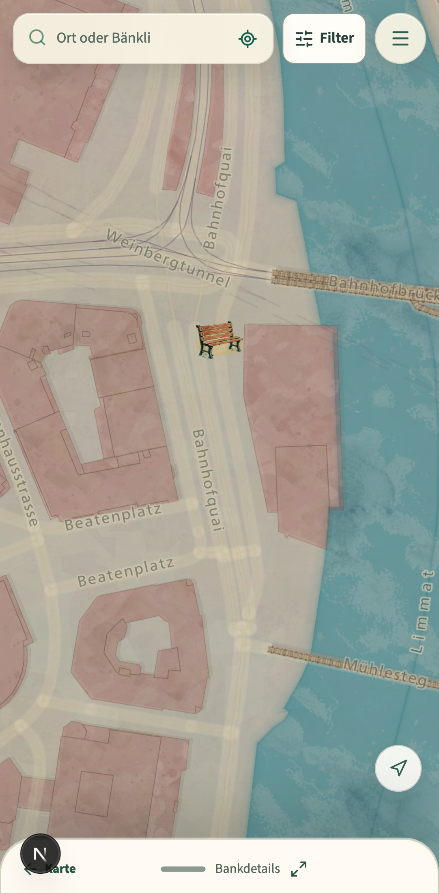
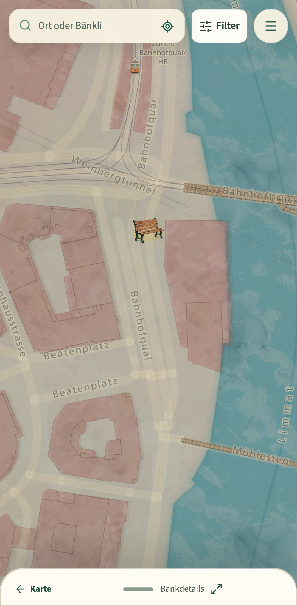
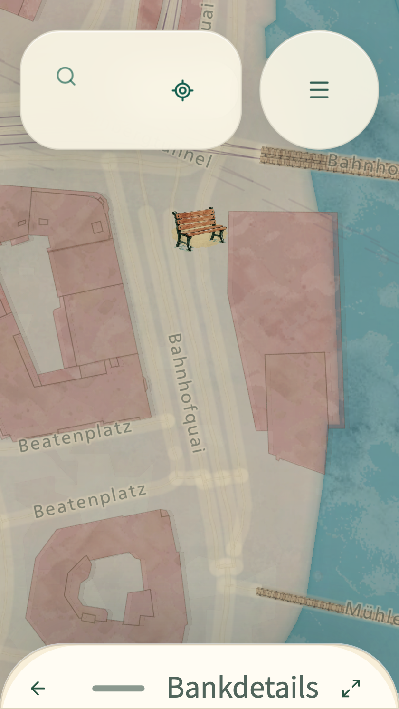

# Professional UI/UX review captures

These are deterministic application screens, not component mockups. They use the seeded `osm-node-101` fixture, the real Source Sans 3/Lora fonts, the packaged watercolor map, and Playwright's Pixel 7 Chromium profile (412 × 839 CSS px). The 200% capture explicitly switches to a 320 × 568 CSS-pixel viewport before enlarging root text to 200%.

## Before and after

The before capture was rendered from the documented audit baseline `cdbd5e8` in an isolated archive. It shows the prior minimized task state, including a competing map-orientation control:



The after captures were rendered against the production build of the revision containing this directory. The active task owns the foreground, the unrelated orientation control is absent, and the bar contains one contextual return, one named expand handle, and no duplicate close/minimize action:



At 200% text and 320 CSS pixels, the return becomes an icon-only control with an accessible name while the task label remains complete:



Additional real-task captures:

- [Structured bench detail](after/structured-bench-detail.png)
- [Sparse bench with missing direction](after/sparse-missing-direction.png)
- [Conflicting fact in the ordinary decision summary](after/conflicting-evidence.png)
- [Saved places after inspection/return](after/saved-places-restored.png)
- [Journey input](after/journey-input.png)
- [Journey result](after/journey-result.png)
- [Walk input](after/walk-input.png)
- [Walk options](after/walk-options.png)
- [Walk resumed after bench inspection](after/walk-resumed-after-bench.png)
- [Raster-map recovery after vector-style failure](after/map-raster-fallback.png)

The retained panorama sets in [`../sky-mock-gallery/after`](../sky-mock-gallery/after/) and [`../terrain-depth-review/after`](../terrain-depth-review/after/) cover deterministic day/night, precipitation, moon/stars, terrain and mobile/desktop rendering.

## Reproduction

Current production captures:

```sh
DATABASE_PATH=/private/tmp/benchly-review/build.sqlite BENCHLY_SEED_DEMO=true npm run build
PLAYWRIGHT_PRODUCTION=1 npx playwright test e2e/bench-detail-polish.spec.ts e2e/journey.spec.ts e2e/walks.spec.ts e2e/mobile-map.spec.ts --project=mobile-chrome --grep 'shows nearby practical|opens a lazy illustrated|draws a complete journal|offers several distinct|chosen walk survives|sheet handle|200% text' --workers=1
```

For the baseline, export `cdbd5e8` to a separate directory, install or copy the same lockfile dependencies inside that directory, and run the `sheet handle` scenario. The baseline capture here was produced from that exact revision; no current CSS was injected into it.

## Inspection notes

- All files in `after/` were opened at native resolution after capture. The minimized bar, enlarged-text state, ordinary/unknown/conflicting facts, saved list, journey chronology, walk input/options and fallback map were visually inspected rather than accepted from an overflow assertion alone.
- The black `N` in the baseline is the Next.js development portal, not product UI. After images use the production server and contain no development overlay.
- No real touch device was connected to this workspace, so no device check is claimed. Chromium touch emulation and mobile WebKit cover tap, drag, focus, viewport and safe-area regressions; field-device review remains part of the human usability script.
